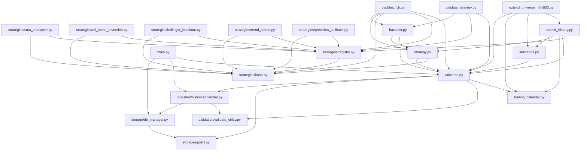
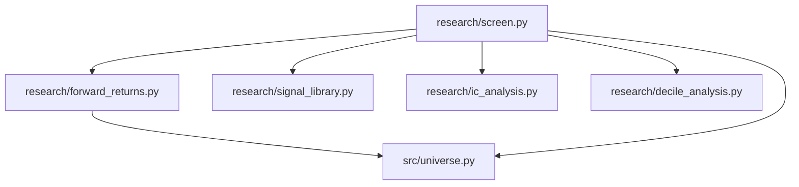

# Architecture

A map of every module in this repo: what it does, what it exposes, what it
depends on, and — just as important for this codebase — which DuckDB tables
it reads and writes. Two modules can be functionally coupled (one only makes
sense because of data the other produces) without a single `import`
connecting them, so both views are here.

**Keeping this updated:** manual, by hand, as part of whatever change
touches a module. Update this file when you: add a new module or delete one;
add/rename/remove a function or class another module calls; add, rename, or
repurpose a DuckDB table; change what a module imports from another
project module. You don't need to update it for internal refactors that
don't change the module's exposed surface or its table usage.

---

## 1. Big picture

Two mostly-independent branches share the same foundation and the same
`ohlcv_data`/`universe` tables, but otherwise don't talk to each other:
**core pipeline → strategies → backtest** (build and test an actual trading
rule), and **research** (cheaply screen whether a raw signal has any
statistical edge before bothering to build a strategy around it — see
`research/README.md`).

### Core pipeline, strategies, backtesting

`extend_universe_nifty500.py` reuses `extend_history.py`'s gap-rate-flagging
logic directly (`_summarize_older_vs_recent_gaps`, `GAP_RATE_FLAG_THRESHOLD`,
`_to_storage_symbols`) rather than duplicating it — another instance of the
private-helper-reuse-across-top-level-scripts pattern noted in §3.

### Research / screening branch

`dbplots.py` isn't on either diagram — it has zero project-module imports,
connects to the DB directly, and reads tables ad hoc (see §4). `main.py`
and `extend_history.py` are the two runnable entry points into the core
pipeline; `research/screen.py` is the entry point into the research branch.

---

## 2. DuckDB tables — the other dependency graph

For this codebase, this table matters as much as the import graph above:
several modules are coupled only through a shared table, with no function
call connecting them at all.

| table | schema owned by | written by | read by |
|---|---|---|---|
| `universe` | `src/universe.py` | `src/universe.py` (`sync_universe`) | `src/universe.py`'s `get_active_universe()` — called from nearly every other module (see §3) rather than queried directly |

| `ohlcv_data` | `src/storage/upsert.py` | `src/storage/upsert.py` (`upsert_ohlcv`), `src/storage/db_manager.py` (`save_candles`) | `src/indicators.py`, `src/strategy.py`, `backtest.py`, `validate_strategy.py`, `extend_history.py` (gap audit), all of `research/`, `dbplots.py` |

| `indicators_daily` | `src/indicators.py` | `src/indicators.py` (`store_indicators`) | `src/strategy.py` (`load_strategy_input` joins it), `dbplots.py`. **Not** read by `strategies/*.py` or `research/*.py` — both compute their own indicators in memory instead (see the quirks list below) |

| `signals` | `src/strategy.py` | `src/strategy.py` (`replace_signals` via `run_strategy`; `store_signals`) | `backtest.py` (`_load_signals`) |

| `backtest_runs`, `backtest_trades`, `backtest_results` | `backtest.py` | `backtest.py` (`store_backtest_results`) | nothing in-repo — query them by hand |

| `data_quality_log` | `src/validation/validate_ohlcv.py` | `src/validation/validate_ohlcv.py` (`log_issues`), invoked from `src/ingestion/historical_fetcher.py` and `src/universe.py`'s `bulk_fetch_and_store` | nothing in-repo — query by hand |

| `data_gaps_log` | `src/trading_calendar.py` | `src/trading_calendar.py` (`log_gaps`) — **only exercised by that file's own `__main__` demo**; `extend_history.py`'s gap audit calls `audit_universe` but never `log_gaps`, so gaps found there are printed, not persisted | nothing — `mark_resolved` exists to mark rows resolved but is never called from anywhere |

| `forward_returns` | `research/forward_returns.py` | `research/forward_returns.py` (`store_forward_returns`) | `research/screen.py` |
| `fetch_checkpoint` | `src/universe.py` | `src/universe.py`'s `resumable_bulk_fetch` (via `_write_checkpoint`) | nothing in-repo — a status journal for manual inspection during/after a large resumable fetch; the *skip* decision itself is made against `ohlcv_data`, not this table (see §3) |

---

## 3. Architectural quirks worth knowing

- **`DEFAULT_DB_PATH` is duplicated**, not shared: `backtest.py`,
  `src/strategy.py`, `src/indicators.py`, and `src/universe.py` each define
  their own identical `Path("data/trading_data.duckdb")` constant (plus
  `src/storage/db_manager.py` as a class attribute). `validate_strategy.py`,
  `extend_history.py`, and `research/*` all import it specifically from
  `src.universe`, informally treating that one as canonical — but nothing
  enforces that, so changing the DB path means editing five files.
- **`validate_strategy.py` reuses `backtest.py`'s "private" internals
  directly** — `bt._build_price_index`, `bt._schedule_executions`,
  `bt._simulate`, `bt._load_daily_prices`, `bt.calculate_metrics` — to avoid
  re-implementing the whole event-driven backtest engine just to run it
  in-memory for a parameter grid. These underscore-prefixed functions in
  `backtest.py` are therefore not really private in practice; treat changing
  their signatures as a breaking change for `validate_strategy.py` too.
- **`strategies/` and `research/` never import each other**, by design, and
  neither reads `indicators_daily`. Both independently mirror the SMA/RSI/
  Bollinger formulas from `src/indicators.py` so they can compute a signal
  at *any* parameter value — `indicators_daily` only stores one fixed
  parameterization per indicator, which can't serve a parameter sweep.
  Expect near-duplicate indicator math in `strategies/sma_crossover.py`,
  `strategies/rsi_mean_reversion.py`, `strategies/bollinger_breakout.py`,
  and `research/signal_library.py` — that duplication is intentional, not
  drift.
- **`dbplots.py` is a standalone, unmaintained exploration script** —
  zero project-module imports, hardcoded/commented-out config at the top,
  connects to the DB read-only and queries tables by raw SQL. Predates the
  rest of this build; nothing depends on it and it depends on nothing else
  here.
- **`fetch_checkpoint` is a status log, not the resumability mechanism
  itself.** `resumable_bulk_fetch`'s skip-before-fetching decision
  (`_has_sufficient_coverage`) always queries `ohlcv_data` directly — the
  actual source of truth for what's been fetched — never `fetch_checkpoint`.
  So the checkpoint table can never itself cause stale-skip bugs even if it
  drifts out of sync with `ohlcv_data` (e.g. after a hard crash); it exists
  purely so a human can see, across multiple runs of a large fetch, which
  symbols succeeded (full or partial range), failed (with why), or were
  skipped, without re-deriving that from `ohlcv_data` by hand. A row stuck
  on `status='pending'` means that symbol was mid-fetch when the process
  last stopped.
- **The "older vs. recent gap rate" flag
  (`extend_history._summarize_older_vs_recent_gaps`, reused by
  `extend_universe_nifty500.py`) gets noisy on a universe with many recent
  listings.** It was designed for a universe where every symbol has full
  history across the audited window (Nifty 50, 5 years) — a stock listed
  partway through the window trivially shows ~100% "gaps" in whichever half
  predates its listing, which looks identical to a real vendor data-quality
  problem unless you cross-check the flagged list against actual listing
  dates. On the Nifty 500, 12-year run, all 189 flagged symbols turned out
  to be partial-history (recent IPO) cases, not genuine older-history data
  quality issues — worth re-verifying this by hand each time this check
  runs on a universe with many recent listings, rather than trusting the
  flag count alone.

---

## 4. Module reference

### Entry-point / top-level scripts

#### `main.py`
One-shot script: ingest 1 year of daily OHLCV for the active universe.
- **`main() -> None`** — gets the active universe via `get_active_universe`, fetches and stores 1y of daily data per symbol via `HistoricalFetcher.fetch_and_store`, prints a verification query.
- **Depends on:** `src.storage.db_manager.DatabaseManager`, `src.ingestion.historical_fetcher.HistoricalFetcher`, `src.universe.get_active_universe`
- **Used by:** nobody (entry point)
- **Tables:** reads/writes `ohlcv_data` indirectly via `DatabaseManager`/`HistoricalFetcher`

#### `extend_history.py`
Extends stored history to N years (default 5) and rebuilds indicators + signals on top of the wider range.
- **`main() -> None`** — fetches N years of OHLCV for the active universe (`bulk_fetch_and_store`), audits the range for gaps (`audit_universe`), backfills `indicators_daily` (`compute_and_store_all`), regenerates `sma_crossover` signals (`run_strategy`), prints a date-coverage/signal-count/gap-rate summary.
- **`_summarize_older_vs_recent_gaps(gaps_df, start_date, end_date) -> pd.DataFrame`** — splits the gap-audit window at its midpoint and flags symbols whose older-history gap rate is materially worse than recent-history (older data quality tends to be worse).
- **`_to_storage_symbols(yf_tickers) -> list[str]`** — strips `.NS` suffixes.
- **Depends on:** `src.indicators.compute_and_store_all`, `src.strategy.run_strategy`, `src.trading_calendar.{audit_universe, get_nse_trading_days}`, `src.universe.{DEFAULT_DB_PATH, bulk_fetch_and_store, get_active_universe}`, `strategies.registry.get_strategy`
- **Used by:** `extend_universe_nifty500.py` (imports `_summarize_older_vs_recent_gaps`, `GAP_RATE_FLAG_THRESHOLD`, `_to_storage_symbols` — otherwise an entry point)
- **Tables:** writes `ohlcv_data`, `indicators_daily`, `signals`; reads `ohlcv_data`

#### `extend_universe_nifty500.py`
Expands the tracked universe from Nifty 50 to Nifty 500 and extends history to 12 years, using the checkpointed/resumable fetcher so the job can be interrupted and re-run without redoing completed work.
- **`main() -> None`** — resolves the active NIFTY500 universe (`get_active_universe(index_name='NIFTY500')`), fetches ~12 years of OHLCV via `resumable_bulk_fetch`, audits for gaps (`audit_universe` + `extend_history`'s older-vs-recent flagging — reused, not duplicated), backfills `indicators_daily` (`compute_and_store_all`), and prints a detailed final summary (row counts, full-vs-partial 12-year coverage per symbol).
- Prints `src.universe.SURVIVORSHIP_BIAS_WARNING` on every run — see `fetch_nifty500_constituents`'s entry below for what it means and why it's unresolved by design.
- **Depends on:** `extend_history.{GAP_RATE_FLAG_THRESHOLD, _summarize_older_vs_recent_gaps, _to_storage_symbols}`, `src.indicators.compute_and_store_all`, `src.trading_calendar.audit_universe`, `src.universe.{DEFAULT_DB_PATH, SURVIVORSHIP_BIAS_WARNING, get_active_universe, resumable_bulk_fetch}`
- **Used by:** nobody (entry point)
- **Tables:** writes `ohlcv_data`, `indicators_daily`, `fetch_checkpoint`, `data_quality_log`; reads `ohlcv_data`, `universe` — note: like `extend_history.py`, this calls `audit_universe` but never `log_gaps`, so gaps found here are printed, not persisted to `data_gaps_log` (see §2/§3)

#### `backtest.py`
Event-driven backtest engine: turns stored `signals` into simulated trades and P&L metrics. Strategy-agnostic — takes a plain `strategy_name` string and never imports `strategies/`.
- **`run_backtest(conn, strategy_name, start_date, end_date, initial_capital=1_000_000, position_sizing='equal_weight', slippage_pct=0.05, symbols=None, max_concurrent_positions=10) -> str`** — the main entry point. Loads signals for `strategy_name` from `signals`, executes each at the *next* trading day's open (no lookahead) with slippage, runs same-morning SELLs before BUYs, sizes each entry as `equity / max_concurrent_positions` (equity at the previous close, capped by available cash, quantity net of buy costs), force-closes anything open at `end_date`, persists everything via `store_backtest_results`, returns the generated `run_id`.
- **`calculate_transaction_cost(trade_value, side) -> float`** — Indian equity delivery cost model (STT, exchange charges, SEBI charges, stamp duty, a flat DP charge per sell, GST), checked against Upstox's brokerage calculator; the flat per-sell DP fee is the module constant `DP_CHARGE_PER_SELL` (broker-dependent). Every stored run records `ENGINE_VERSION` in `backtest_runs.engine_version` (NULL for runs recorded before the column existed).
- **`calculate_metrics(trades_df, equity_curve, initial_capital, risk_free_rate=0.06) -> dict`** — total_trades, win_rate, total_return_pct, cagr, max_drawdown_pct, sharpe_ratio, final_equity.
- **`store_backtest_results(conn, run_id, strategy_name, start_date, end_date, initial_capital, position_sizing, trades_df, metrics) -> None`** — writes one row to `backtest_runs`, one to `backtest_results`, N rows to `backtest_trades`.
- **`ensure_backtest_schema(conn) -> None`** — creates all three `backtest_*` tables.
- *Private, but reused externally by `validate_strategy.py` (see quirks above):* `_load_signals`, `_load_daily_prices`, `_build_price_index`, `_schedule_executions`, `_simulate`, `_close_position`, `_normalize_symbols`.
- **Depends on:** `src.strategy.ensure_signals_schema`, `src.universe.get_active_universe`; `__main__` block additionally uses `strategies.registry.get_strategy`
- **Used by:** `validate_strategy.py` (imports the module as `bt`, calls both public and private functions), `backtest_cli.py` (imports `run_backtest`)
- **Tables:** reads `signals`; writes `backtest_runs`, `backtest_trades`, `backtest_results`

#### `backtest_cli.py`
Interactive CLI (`python -m backtest_cli`) for `backtest.py` + `strategies/` — full manual in the root `README.md`. List registered strategies and their tunable parameters, run a backtest with parameter overrides against a single symbol or the full active universe, and revisit/compare stored results, all without a one-off script.
- **`main(argv=None) -> int`** — argparse entry point; subcommands `list-strategies`, `list-params`, `run`, `show-results`, `compare`.
- **`_run_command`** generates signals via `src.strategy.run_strategy` and *then* backtests via `backtest.run_backtest` — these are two separate steps because `run_backtest()` itself never generates signals, only backtests what's already in `signals` (see `backtest.py`'s entry above).
- Every registered `Strategy`'s config is validated at construction time (`Strategy.__init__` → `config.validate()`, see `strategies/base.py`) — `run` surfaces a bad `--params` combination immediately, before touching the database.
- **Depends on:** `backtest.run_backtest`, `src.strategy.run_strategy`, `src.universe.{DEFAULT_DB_PATH, get_active_universe}`, `strategies.base.Strategy`, `strategies.registry.{available_strategies, get_strategy}`
- **Used by:** nobody (entry point)
- **Tables:** writes `signals`, `backtest_runs`, `backtest_trades`, `backtest_results`; reads `universe`, `ohlcv_data`, `indicators_daily`

#### `validate_strategy.py`
Parameter sensitivity search + in-sample/out-of-sample train/test split, generalized across any registered strategy. Nothing here persists to `signals` or `backtest_*` — it's a research tool, entirely in-memory.
- **`compute_in_sample_split(conn, in_sample_fraction=0.8) -> tuple[str, str, str, str]`** — splits the full available OHLCV trading-day history into `(full_start, in_sample_end, out_of_sample_start, full_end)`.
- **`run_parameter_grid(conn, strategy_name, param_grid, start_date, end_date) -> pd.DataFrame`** — for each config dict in `param_grid`, instantiates `get_strategy(strategy_name)(**params)`, runs its `generate_signals` in memory, backtests via `backtest.py`'s private engine functions, returns one row per combo with `cagr`/`sharpe_ratio`/`max_drawdown_pct`/`total_trades`/`win_rate`.
- **`print_grid_results(results) -> None`** — prints the grid sorted by Sharpe descending, with a standing "don't just pick the top row" caution.
- **`run_out_of_sample_test(conn, strategy_name, out_of_sample_start, out_of_sample_end, **strategy_params) -> dict`** — the one-shot, real out-of-sample check for a manually chosen config.
- **Depends on:** `backtest` (as `bt`, including private helpers), `strategies.registry.get_strategy`, `src.universe.{DEFAULT_DB_PATH, get_active_universe}`
- **Used by:** nobody (entry point / interactive tool)
- **Tables:** reads `ohlcv_data`; writes nothing

#### `dbplots.py`
Standalone ad hoc DB-exploration/plotting script — see quirks above. `connect`, `list_tables`, `describe_table`, `get_commodity_prices`, `plot_price`, `plot_price_with_feature`. No project-module dependents or dependencies.

---

### `src/` — foundation and data pipeline

#### `src/storage/upsert.py`
Lowest-level OHLCV persistence: idempotent insert-or-update into `ohlcv_data`.
- **`upsert_ohlcv(conn, df, timeframe='1d') -> dict`** — validated OHLCV in, `(rows_inserted, rows_updated, total_rows)` out. `ON CONFLICT (symbol, timestamp, timeframe) DO UPDATE`.
- **`ensure_ohlcv_upsert_schema(conn) -> None`** — creates `ohlcv_data` (or `ALTER TABLE ... ADD COLUMN IF NOT EXISTS` for columns added after the table already existed).
- **Depends on:** nothing project-internal
- **Used by:** `src/storage/db_manager.py`, `src/universe.py`
- **Tables:** writes `ohlcv_data`

#### `src/storage/db_manager.py`
Thin OO wrapper for OHLCV storage, used by the original ingestion path.
- **`class DatabaseManager`** — `get_connection()` (context manager), `save_candles(df, timeframe)` (→ `upsert_ohlcv`), `fetch_candles(symbol, timeframe)`, `init_db()`.
- **Depends on:** `src.storage.upsert.upsert_ohlcv`
- **Used by:** `main.py`, `src/ingestion/historical_fetcher.py`
- **Tables:** writes/reads `ohlcv_data`

#### `src/ingestion/historical_fetcher.py`
Per-symbol yfinance fetch + validate + store.
- **`class HistoricalFetcher`** — `fetch_and_store(symbol, interval='1d', period='1y')` (downloads via yfinance, validates via `validate_ohlcv`, logs issues, saves via `DatabaseManager`); static helpers `_to_yfinance_symbol`/`_to_storage_symbol`/`_prepare_candles` (the latter two also called directly from `src/universe.py`).
- **Depends on:** `src.storage.db_manager.{DatabaseManager, OHLCV_COLUMNS}`, `src.validation.validate_ohlcv.{validate_ohlcv, log_issues}`
- **Used by:** `main.py`, `src/universe.py`
- **Tables:** writes `ohlcv_data`, `data_quality_log`

#### `src/validation/validate_ohlcv.py`
Data-quality checks run before any OHLCV batch is stored. Never raises or mutates input — returns a structured issues report.
- **`validate_ohlcv(df, symbol) -> pd.DataFrame`** — runs all checks (`check_missing_values`, `check_ohlc_violations`, `check_zero_negative_prices`, `check_zero_volume`, `check_flat_days`, `check_duplicate_rows`, `check_extreme_price_jumps`, each individually callable too), returns combined issues (`error` severity gets the row dropped by the caller; `warning` doesn't).
- **`log_issues(conn, issues_df) -> None`** / **`init_data_quality_log(conn) -> None`**.
- **Depends on:** nothing project-internal
- **Used by:** `src/ingestion/historical_fetcher.py`, `src/universe.py`
- **Tables:** writes `data_quality_log`

#### `src/universe.py`
Nifty 50 / Nifty 500 membership tracking + bulk OHLCV fetch orchestration, plain and resumable/checkpointed. The most widely-depended-on module in the repo (`get_active_universe`/`DEFAULT_DB_PATH` are used almost everywhere).
- **`get_active_universe(conn, index_name='NIFTY50', as_of_date=None) -> list[str]`** — yfinance tickers (`RELIANCE.NS` form) currently active in the universe table for the given index (pass `index_name='NIFTY500'` for the broader universe).
- **`sync_universe(conn, constituents, index_name='NIFTY50') -> dict`** — upserts current constituents, marks removed ones inactive (never deletes history). The "already active" check is scoped by `index_name`, so a symbol can have separate active rows under both `NIFTY50` and `NIFTY500` simultaneously — that's a second, non-duplicate membership record, not a bug (see §3).
- **`fetch_nifty50_constituents() -> list[dict]`** — live CSV fetch (NSE archives → niftyindices.com → local manual CSV fallback). Thin wrapper around `_fetch_index_constituents`.
- **`fetch_nifty500_constituents() -> list[dict]`** — same fetch-with-fallback pattern for the Nifty 500 (`NIFTY500_CSV_URLS` → `data/nifty500_manual.csv`). Always prints `SURVIVORSHIP_BIAS_WARNING` first: this returns *current* Nifty 500 membership only, so backfilling years of history against it silently excludes companies removed/delisted/renamed/merged out of the index at any point in that window — a deliberate, accepted tradeoff (point-in-time historical membership isn't freely available), not an oversight. Keep this in mind interpreting any backtest built on this dataset.
- **`bulk_fetch_and_store(conn, tickers, start_date, end_date, interval='1d', delay_seconds=0.75) -> dict`** — per-ticker yfinance fetch + validate + upsert, `{successful, failed}` ticker lists. No checkpointing; fine for small/fast batches (e.g. `extend_history.py`'s 50 symbols).
- **`resumable_bulk_fetch(conn, tickers, start_date, end_date, interval='1d', delay_seconds=2.0, coverage_tolerance_days=10) -> dict`** — checkpointed variant for large batches (e.g. 500 symbols × 12 years) that may span multiple runs. Before fetching each symbol, checks `ohlcv_data` directly (never `fetch_checkpoint` — see §3) for sufficient existing coverage and skips if so; logs every attempt (`pending` → `success`/`failed`/`skipped`) to `fetch_checkpoint`. Partial history (e.g. a recent IPO) is reported separately from full-range success, never treated as failure. Returns `{succeeded_full, succeeded_partial, skipped, failed, rows_added}`.
- **`ensure_fetch_checkpoint_schema(conn) -> None`** / **`ensure_universe_schema(conn) -> None`**
- *Private, shared internals:* `_fetch_index_constituents` (fetch-with-fallback core behind both `fetch_nifty50_constituents` and `fetch_nifty500_constituents`), `_fetch_validate_upsert_one` (per-ticker fetch/validate/upsert core shared by `bulk_fetch_and_store` and `resumable_bulk_fetch`, so the two orchestrators can't drift out of sync on the actual fetch logic), `_has_sufficient_coverage`, `_write_checkpoint`.
- **Depends on:** `src.ingestion.historical_fetcher.HistoricalFetcher`, `src.storage.upsert.upsert_ohlcv`, `src.validation.validate_ohlcv.{log_issues, validate_ohlcv}`, `src.trading_calendar.audit_universe`
- **Used by:** `main.py`, `extend_history.py`, `extend_universe_nifty500.py`, `backtest.py`, `validate_strategy.py`, `src/strategy.py`, `src/indicators.py`, all of `research/`
- **Tables:** writes `universe`, `ohlcv_data`, `data_quality_log`, `fetch_checkpoint`; reads `universe`, `ohlcv_data`

#### `src/trading_calendar.py`
Trading-day gap detection against the real NSE calendar (via `pandas_market_calendars`).
- **`get_nse_trading_days(start_date, end_date) -> pd.DatetimeIndex`** — valid NSE session dates (falls back to BSE/`XBOM`).
- **`audit_universe(conn, symbols, start_date, end_date) -> pd.DataFrame`** — combined missing-trading-day report across symbols (prints a per-symbol summary as a side effect).
- **`find_missing_trading_days(conn, symbol, start_date, end_date) -> pd.DataFrame`**
- **`log_gaps(conn, gaps_df) -> None`** / **`mark_resolved(conn, symbol, date) -> None`** — see quirks above (both currently under-used outside this file's own demo).
- **Depends on:** `pandas_market_calendars` (external)
- **Used by:** `src/universe.py`, `extend_history.py`
- **Tables:** writes `data_gaps_log`; reads `ohlcv_data`

#### `src/indicators.py`
Fixed-parameterization technical indicators (SMA-20/50, EMA-12/26, RSI-14, 20-day volatility, Bollinger 20/2.0), computed once and shared. **Not** consulted by `strategies/` or `research/` (see quirks above) — this is the "official," single-parameterization feature set.
- **`compute_and_store_all(conn, symbols=None) -> dict`** — loads OHLCV, computes, upserts into `indicators_daily`. Safe to re-run after new OHLCV lands.
- **`compute_indicators(df) -> pd.DataFrame`** — pure computation, no DB I/O; per-symbol grouped/sorted rolling calcs.
- **`store_indicators(conn, df) -> dict`**
- **`ensure_indicators_schema(conn) -> None`**
- **Depends on:** `src.universe.get_active_universe`
- **Used by:** `extend_history.py`, `src/strategy.py` (via `indicators_daily` reads, not a function call)
- **Tables:** writes `indicators_daily`; reads `ohlcv_data`

#### `src/market_regime.py`
Nifty 50 index-level market-regime state, shared by `trend_ladder` and `precision_pullback`. Bridges the gap those strategies used to document as architectural (needing a "second symbol's" data inside `generate_signals`) without changing `Strategy`'s interface or `backtest.py`'s engine: the index's own OHLCV is fetched/stored in `ohlcv_data` under `^NSEI` like any other symbol, and its derived state is broadcast onto every other symbol's row by date.
- **`fetch_nifty_index_history(conn, start_date, end_date) -> dict`** — thin wrapper over `src.universe.bulk_fetch_and_store(tickers=["^NSEI"], ...)`; same fetch/validate/upsert pipeline as any other symbol.
- **`load_market_regime(conn) -> pd.DataFrame`** — one row per date `^NSEI` has data for: `nifty_close`, `nifty_ema_100`, `nifty_regime_bullish` (close >= its own 100-EMA, fail-open `True` during warm-up), `nifty_regime_breakdown` (the one-time day it crosses from at/above to below — this repo's own interpretation of the source specs' undefined "breakdown pattern", not a verified transcription of it). Empty (with these columns) if `^NSEI` was never fetched.
- **`attach_market_regime(df, regime_df) -> pd.DataFrame`** — left-joins `regime_df` onto `df` **by date only** (broadcast, not per-symbol); fails open (`bullish=True`, `breakdown=False`) wherever regime data doesn't cover a date, including when `regime_df` is empty — silently blocking every entry because the index hasn't been fetched yet would be worse than not gating at all.
- **Depends on:** `src.universe.bulk_fetch_and_store`
- **Used by:** `src.strategy.load_strategy_input`, `validate_strategy._load_ohlcv_history`
- **Tables:** reads `ohlcv_data` (symbol `^NSEI`); `fetch_nifty_index_history` writes it (via `bulk_fetch_and_store`)

#### `src/strategy.py`
Orchestration layer between a `strategies.Strategy` instance and the database — loads merged input, runs `generate_signals`, persists, summarizes. Strategy-class-agnostic (works with any `Strategy` subclass via polymorphism, not string dispatch).
- **`run_strategy(conn, strategy, symbols=None) -> dict`** — the main entry point: `load_strategy_input` → `strategy.generate_signals(df)` → `replace_signals` (the strategy's stored signals for every covered symbol are replaced, not merged), prints a run summary.
- **`load_strategy_input(conn, symbols=None) -> pd.DataFrame`** — joins `ohlcv_data` (timeframe `1d`) with `indicators_daily` on `(symbol, date)`; full history, unbounded by date. Also attaches the Nifty market-regime columns via `src.market_regime.attach_market_regime` — every strategy gets them, whether or not it uses them.
- **`store_signals(conn, signals_df) -> dict`** — upsert into `signals`, `ON CONFLICT (symbol, date, strategy) DO UPDATE`; never deletes.
- **`replace_signals(conn, strategy_name, symbols, signals_df) -> dict`** — in one transaction, deletes the strategy's rows for `symbols` that `signals_df` does not rewrite, then upserts `signals_df`.
- **`summarize_signals(conn, strategy_name) -> None`** — prints BUY/SELL totals, per-symbol breakdown, 5 most recent signals.
- **`ensure_signals_schema(conn) -> None`**
- **Depends on:** `strategies.base.{SIGNAL_OUTPUT_COLUMNS, Strategy}` (type only), `src.universe.get_active_universe`, `src.market_regime`
- **Used by:** `extend_history.py`, `backtest.py` (imports `ensure_signals_schema` only)
- **Tables:** writes `signals`; reads `ohlcv_data`, `indicators_daily`

---

### `strategies/` — registered trading strategies

Two strategies below (`trend_ladder`, `precision_pullback`) were ported from
external PDF specs, each with its own published backtest. Both have parts of
the written strategy deliberately not implemented — see `strategies/README.md`
for the consolidated list of every omission, why, and how this repo's backtest
result compares to each spec's published numbers; each is also noted in its
own module docstring.

#### `strategies/base.py`
Abstract base class + config mechanism every concrete strategy builds on.
- **`class Strategy(ABC)`** — `base_name` (registry key), `config_cls` (its `StrategyConfig` dataclass type), `required_columns` (input columns `generate_signals` needs), `name` property (defaults to `base_name`; `SmaCrossoverStrategy` overrides it to fold in config), `validate_columns(df)`, abstract `generate_signals(df) -> pd.DataFrame`. `__init__(**config_kwargs)` builds `self.config = config_cls(**config_kwargs)` and immediately calls `self.config.validate()` — so `SmaCrossoverStrategy(fast_window=100, slow_window=20)` (or any other nonsensical combo) raises `ValueError` at construction time, not later inside `generate_signals` or as a silently-empty signal set. `backtest_cli.py`'s `run` command relies on this to reject a bad `--params` combination immediately.
- **`class StrategyConfig`** — frozen-dataclass base; subclass per strategy, using `dataclasses.field(default=..., metadata={"description": "..."})` so each field's description is introspectable.
  - **`param_info() -> dict[str, ParamInfo]`** — classmethod; one `ParamInfo(name, default, description)` per dataclass field, description pulled from that field's `metadata["description"]` (empty string if unset). This is how `backtest_cli.py`'s `list-params` command and its unknown-parameter validation work without any separate per-strategy registration — add a field to a `StrategyConfig` subclass and it shows up automatically.
  - **`validate() -> None`** — no-op by default; a subclass overrides it to add cross-field checks (e.g. `SmaCrossoverConfig` requires `fast_window < slow_window`, `BollingerBreakoutConfig` requires a supported `exit_mode`). Called automatically by `Strategy.__init__`, not something callers invoke themselves.
- **`class ParamInfo(NamedTuple)`** — `name`, `default`, `description`; the return element of `param_info()`.
- **`SIGNAL_OUTPUT_COLUMNS`** — the canonical signal-row shape (`symbol, date, strategy, signal_type, price, reason`), re-exported and used by `src/strategy.py` too.
- **`first_exit_after_each_buy(buy, exit_condition, disarm) -> list[bool]`** — for one symbol's rows in date order, marks the first exit-condition day after each BUY (a `disarm` day, e.g. a Nifty exit-all, clears the pending exit). Used by `trend_ladder` and `precision_pullback` so an exit fires once per entry without being missed when it comes after the crossing day.
- **Depends on:** nothing project-internal
- **Used by:** every file in `strategies/`, `src/strategy.py` (imports `Strategy`/`SIGNAL_OUTPUT_COLUMNS`), `backtest_cli.py` (imports `Strategy` for typing, and drives `list-params`/`run`'s parameter validation through `param_info()`/`validate()`)

#### `strategies/registry.py`
Name → class lookup, avoiding an if/elif chain.
- **`register_strategy(name) -> decorator`** — class decorator; registers under `name` (raises if `name` is already taken by a *different* class).
- **`get_strategy(name) -> type[Strategy]`** — raises `KeyError` listing available names if unknown.
- **`available_strategies() -> list[str]`**
- **Depends on:** `strategies.base.Strategy` (type only)
- **Used by:** `strategies/{sma_crossover,rsi_mean_reversion,bollinger_breakout}.py` (via the decorator), `src/strategy.py`, `backtest.py`, `extend_history.py`, `validate_strategy.py`

#### `strategies/__init__.py`
Imports every concrete strategy module for its `@register_strategy` side effect — this is *why* `from strategies.registry import get_strategy` alone is enough to see every registered strategy: importing `strategies.registry` first triggers `strategies/__init__.py`.

#### `strategies/sma_crossover.py`
- **`class SmaCrossoverStrategy(Strategy)`**, `base_name='sma_crossover'`, config `SmaCrossoverConfig(fast_window=20, slow_window=50)`. BUY when fast SMA crosses above slow SMA, SELL on the reverse. `name` folds in windows (e.g. `sma_crossover_20_50`) so different configs don't collide in `signals`' primary key.
- **Depends on:** `strategies.base`, `strategies.registry`

#### `strategies/rsi_mean_reversion.py`
- **`class RsiMeanReversionStrategy(Strategy)`**, `base_name='rsi_mean_reversion'`, config `RsiMeanReversionConfig(rsi_period=14, oversold_threshold=30, exit_threshold=50)`. BUY on crossing into oversold, SELL on crossing back past the exit level. `name` is the flat literal `'rsi_mean_reversion'` — does **not** fold in config (unlike SMA), so persisting two different RSI configs via `run_strategy` would collide.
- **Depends on:** `strategies.base`, `strategies.registry`

#### `strategies/bollinger_breakout.py`
- **`class BollingerBreakoutStrategy(Strategy)`**, `base_name='bollinger_breakout'`, config `BollingerBreakoutConfig(window=20, num_std=2.0, exit_mode='middle_band_revert')`. BUY on a close breaking above the upper band, SELL per `exit_mode` (`_compute_exit_mask` is the single dispatch point for adding a new exit mode later).
- **Depends on:** `strategies.base`, `strategies.registry`

#### `strategies/trend_ladder.py`
Ported from an external "Trend Ladder Strategy" spec (Chartink scanner + entry/exit rules + a published 13-year Nifty 500 backtest).
- **`class TrendLadderStrategy(Strategy)`**, `base_name='trend_ladder'` (flat name, like RSI/Bollinger — same signal-collision caveat applies), config `TrendLadderConfig` (EMA 10/20/50/100/200, ADX(14) > 15, volume > 1.2x its 20-day average, 3-day momentum, a `min_body_ratio` doji filter this repo added since the source spec names it qualitatively only). BUY when all 11 scanner-style conditions align *and* price is crossing back above the 20 EMA (a fresh ladder rung); SELL on the first bearish candle closing below it after each BUY (`strategies.base.first_exit_after_each_buy`).
- **`_compute_adx(high, low, close, period) -> pd.Series`** — Wilder-style ADX via `ewm(alpha=1/period)`; the first indicator in this repo not already in `indicators.py`, so it's self-contained here like every other strategy's indicator math.
- **Nifty 50 market-regime filter implemented** (`src/market_regime.py`): no new BUY while the index's own close is below its 100-EMA; an unconditional "exit-all" SELL (reason `"Nifty filter exit-all"`) the one day the index's close crosses from at/above that EMA to below it. Bridged without a `Strategy` interface or engine change — the index's own OHLCV lives in `ohlcv_data` under `^NSEI` like any other symbol, and its derived regime columns are broadcast onto every other symbol's row by date in `load_strategy_input`/`validate_strategy._load_ohlcv_history`. Inert (no effect) if those columns aren't attached, so this was additive over `required_columns`. See `strategies/README.md`'s "Now implemented" section for the exact interpretation of "breakdown pattern" (not pinned down by the source spec) and the resulting before/after numbers.
- **Still deliberately not implemented** (see the module docstring for the full reasoning): laddering (multiple entries per symbol — matches the source spec's own *tested* config, and `backtest.py`'s engine already enforces one-position-per-symbol for every strategy); the source spec's risk-based/allocation-capped position sizing and separate hard percentage stop, since `backtest.py` only implements `position_sizing='equal_weight'` and has no percentage-stop concept — both are properties of the shared engine, not of one strategy.
- **Depends on:** `strategies.base`, `strategies.registry`, `src.market_regime`

#### `strategies/precision_pullback.py`
Ported from an external "Precision Pullback Strategy" spec (a colour-coded 50-EMA band + a six-step entry sequence + a published 13-year Nifty 500 backtest).
- **`class PrecisionPullbackStrategy(Strategy)`**, `base_name='precision_pullback'` (flat name), config `PrecisionPullbackConfig(ema_period=50, blue_days_required=90)`. Unlike every other strategy here, this one is a genuine multi-day **state machine**, not an independent per-row crossing condition — whether today is a valid entry depends on a specific sequence (90+ day qualifying streak → pullback below the EMA → a full-body recovery candle → a tracked pullback high → a continuation close above that high) having already played out, so signal generation is a sequential per-symbol scan (`_scan_symbol`) through five states (`_State` enum), not vectorized boolean masks. Verified against hand-traced synthetic scenarios (both the happy path and the mid-sequence reset-on-red path) before running on real data, given the logic's complexity. SELL fires on the first bearish candle closing below the 50 EMA after each BUY (`strategies.base.first_exit_after_each_buy`), not only on the crossing day.
- **Nifty 50 market-regime filter implemented** — identical mechanism to `trend_ladder`'s (see above and `src/market_regime.py`).
- **Still deliberately not implemented** (see the module docstring): the "one re-entry per cycle within 20 days, referencing the previous trade's high" rule — needs per-trade state (a specific trade's high-since-entry) that signal generation, computed once up front independent of the later backtest simulation, has no way to know; **this one is part of the source spec's own tested config**, unlike Trend Ladder's omitted laddering, so it's expected to cause more divergence from the published backtest. Also still omitted, for the identical reason as `trend_ladder`: risk-based/allocation-capped sizing and a separate hard percentage stop.
- **Depends on:** `strategies.base`, `strategies.registry`, `src.market_regime`

#### `strategies/bollinger_reversion.py`
Not ported from an external spec — built directly from a `research/screen.py` finding (see `research/signal_library.py`'s `bb_position` and this module's own docstring for the full validation trail). One of two **cross-sectional** strategies in this package (the other is `illiquidity_tilt`, below): every other strategy reacts to a single symbol's own price history in isolation, these two rank every symbol in the input against each other on the same date.
- **`class BollingerReversionStrategy(Strategy)`**, `base_name='bollinger_reversion'`, config `BollingerReversionConfig(window=30, num_std=2.0, bottom_quantile=0.2, holding_period_days=30, stop_loss_pct=15.0)`, name folds `window`/`holding_period_days` in (same collision-avoidance precedent as `SmaCrossoverStrategy`). BUY a symbol not already in an active holding cycle the day it lands in the bottom `bottom_quantile` of the whole input's `bb_position` (same formula as `research/signal_library.py`'s, so it trades exactly what was screened); SELL on whichever comes first of (1) exactly `holding_period_days` *trading* days later regardless of rank at that point — a direct translation of the N-day-forward-return claim the screen actually tested, not "hold until it reverts" — or (2) a per-position stop-loss if price closes `stop_loss_pct` or more below entry at any point during the hold. The stop-loss was NOT part of the original screen — added, tuned (by directly simulating several threshold levels against a real historical run), and kept after it measurably improved CAGR and Sharpe while leaving win rate essentially unchanged. A Nifty-regime filter (same mechanism as `trend_ladder`/`precision_pullback`) was tried for the same problem FIRST and reverted after measuring it live — made things worse (win rate collapsed, Sharpe went negative) — see the module docstring for the full numbers; this is the third strategy in this package where that regime filter measurably hurt results.
- Validated on, and only on, the Nifty 50 (large-cap) universe — the same effect reverses sign on the broader Nifty 500's mid/small-cap half (see `research/README.md`/this module's docstring). Universe selection is left to the caller, same as every other strategy; nothing enforces the restriction. A single-symbol input can never produce a BUY (ranking one symbol against itself always gives the 100th percentile) — intentional, not a bug.
- **Depends on:** `strategies.base`, `strategies.registry`

#### `strategies/illiquidity_tilt.py`
Not ported from an external spec — built directly from a `research/screen.py` finding on `amihud_illiquidity` (see `research/signal_library.py` and this module's own docstring for the full validation trail, including why the signal's apparent strength needed real scrutiny: it climbed with no plateau across every horizon tested, and its top-illiquidity bucket turned out to have almost no day-to-day membership turnover — a few names sit in it 80%+ of all their trading days). Excluding the four most persistent such names barely weakened it, and it survives — weaker but still present — on the full Nifty 500, so it's treated as real but structurally different from a reactive signal: a slow, persistent portfolio TILT, not a tactical trade.
- **`class IlliquidityTiltStrategy(Strategy)`**, `base_name='illiquidity_tilt'`, config `IlliquidityTiltConfig(window=20, top_quantile=0.2, rebalance_every_days=63)`, name folds `window`/`rebalance_every_days` in. Architecturally different from `bollinger_reversion` despite both being cross-sectional: this one maintains a single GLOBAL `held` set and only acts on a fixed rebalance schedule (every `rebalance_every_days` trading days) — at each rebalance, SELL anything held that dropped out of the top `top_quantile` by Amihud illiquidity, BUY anything newly in it, leave everything else untouched. A held symbol simply missing a data point on a rebalance day is left alone (neither sold nor re-evaluated) rather than force-closed. A single-symbol input always buys once warmed up — the OPPOSITE of `bollinger_reversion`'s single-symbol behavior, since this strategy's top-quantile check can't fail to admit a universe of one.
- Validated on, and only on, the Nifty 50 — the effect is materially weaker on the full Nifty 500. Universe selection is left to the caller.
- **Depends on:** `strategies.base`, `strategies.registry`

---

### `research/` — signal screening (pre-strategy research layer)

See `research/README.md` for the full module-by-module writeup and CLI manual; summarized here for the dependency map.

#### `research/forward_returns.py`
- **`compute_and_store_forward_returns(conn, symbols=None, horizons=None) -> dict`** — loads `adj_close` from `ohlcv_data`, computes, upserts into `forward_returns`.
- **`compute_forward_returns(df, horizons=None) -> pd.DataFrame`** — pure computation using real trading-day `.shift(-N)` offsets.
- **`store_forward_returns(conn, df) -> dict`**, **`ensure_forward_returns_schema(conn) -> None`**.
- **Depends on:** `src.universe.{DEFAULT_DB_PATH, get_active_universe}`
- **Used by:** `research/screen.py`
- **Tables:** writes/reads `forward_returns`; reads `ohlcv_data`

#### `research/signal_library.py`
- **`get_signal(name) -> SignalSpec`** / **`available_signals() -> list[str]`** / **`register_signal(name, default_params) -> decorator`** — registry, mirroring `strategies/registry.py`'s pattern.
- Six registered signals: `momentum`, `volume_weighted_momentum`, `rsi_level`, `bb_position`, `volatility`, `cross_sectional_rank_momentum` — each `(df, params) -> pd.Series`, each self-contained (own indicator math, no `indicators_daily` dependency).
- **Depends on:** nothing project-internal
- **Used by:** `research/screen.py`

#### `research/ic_analysis.py`
- **`calculate_ic(signal_series, forward_return_series, dates, symbols, method='spearman') -> pd.DataFrame`** — daily cross-sectional rank (or linear) correlation. Spearman computed as Pearson-of-ranks, not via `scipy` (not a project dependency).
- **`summarize_ic(ic_df) -> dict`** — `mean_ic, std_ic, ic_ir, pct_positive_days, t_stat, n_days`.
- **`plot_ic_over_time(ic_df, output_path) -> Path`**.
- **Used by:** `research/screen.py`

#### `research/decile_analysis.py`
- **`bucket_by_decile(signal_series, forward_return_series, dates, symbols, n_buckets=5) -> pd.DataFrame`**
- **`summarize_deciles(bucket_df) -> pd.DataFrame`** — per-bucket mean forward return + a `'spread'` row.
- **`plot_decile_returns(summary_df, output_path) -> Path`**.
- **Used by:** `research/screen.py`

#### `research/screen.py`
CLI entry point (`python -m research.screen {run,batch}`) tying the above together.
- **`screen_signal(conn, signal_name, params, horizon, start_date, end_date, symbols, method, output_dir, history=None) -> dict`** — the core orchestration: load OHLCV, compute the signal, join to `forward_returns`, run IC + decile analysis, save plots/JSON, return a result dict.
- **`verdict_for(mean_ic, t_stat, n_days) -> str`** — plain-English verdict from thresholds.
- **`main(argv=None) -> int`** — argparse CLI (`run` = one signal, `batch` = many + comparison table).
- **Depends on:** `research.{decile_analysis, forward_returns, ic_analysis, signal_library}`, `src.universe.{DEFAULT_DB_PATH, get_active_universe}`
- **Used by:** nobody (entry point)
- **Tables:** writes/reads `forward_returns` (via `forward_returns.py`); reads `ohlcv_data`
